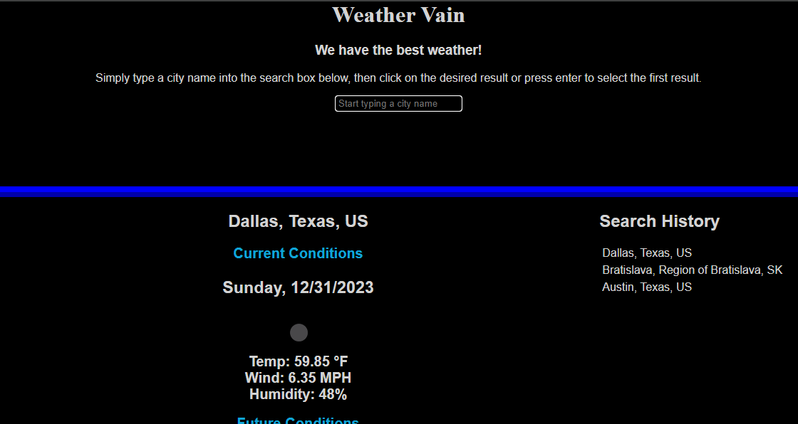

# Weather Vain

## Description

Live URL: https://alexilson.github.io/weather-vain/

Repo URL: https://github.com/alexilson/weather-vain/

Weather Vain is your go-to weather app for a delightful and comprehensive forecast experience. With the catchy slogan, "We have the best weather!", this app ensures that you stay ahead of the elements in style. Offering both current conditions and a detailed 5-day forecast, Weather Vain provides you with all the essential weather information you need to plan your day or week effectively.

## Table of Contents
[Installation](#installation)

[Usage](#usage)

[License](#license)

[Questions](#questions)

## Installation
Clone the repository and open index.html in the browser of your choice.

## Usage
Simply type the name of the city that you want to view the weather of into the search box and either press enter to select the first result, or click on teh result you want. The app also saves your search history ,  click on any of the  saved searches on teh right sid eof the screen to bring up that city again.

## License

## Questions
For additional questions, please contact me here:

GitHub: https://www.github.com/alexilson

Email: ilson.alex@gmail.com
